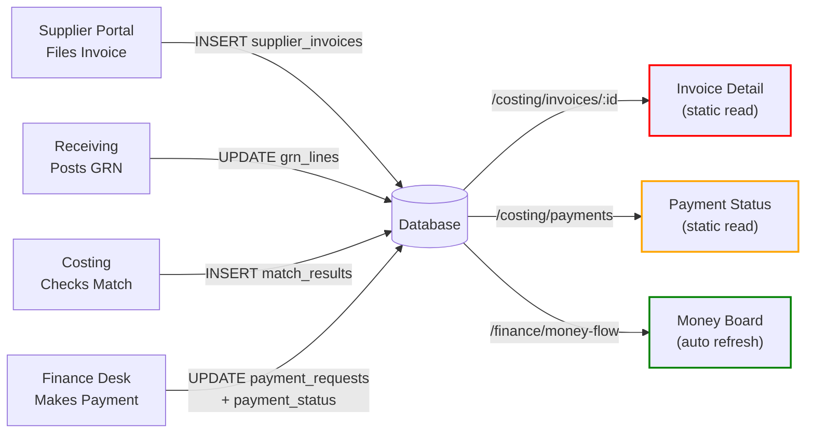

# Invoice & Payment Consolidation Plan

## Current State (Fragmented)

### Where Invoice/Payment Data Lives

| Page | Module | What It Shows | Data Source | Updates From |
|------|--------|---------------|-------------|--------------|
| **Invoices & Match** | Finance.tsx | Single invoice detail, 3-way match reconciliation, payment card | `/costing/invoices/:id` | Supplier Portal, Receiving, Finance |
| **Payment Status** | Finance.tsx | List of all payables, payments, balance | `/costing/payments` | Finance Desk, Money Flow |
| **Finance Desk - DUES** | FinanceDesk.tsx | Supplier invoices waiting to be paid | `/finance/dues` | Finance (payable requests) |
| **Money Board** | MoneyFlow.tsx | Cash flow visualization, latest transactions | `/finance/money-flow` | Finance payments, receipts |
| **Supplier Portal** | SupplierPortal.tsx | Suppliers file invoices, track status | Query own invoices | Supplier, Finance |

### The Redundancy Problem

```
Current flow:
Supplier files invoice
    ↓
Invoice appears in:
  ├─ Invoices list (Finance.tsx)
  ├─ Invoice detail (Finance.tsx) ← 3-way match info + payment card
  ├─ Finance Desk DUES (FinanceDesk.tsx)
  └─ Payment Status list (Finance.tsx)
    ↓
Finance makes payment
    ↓
Update appears in:
  ├─ Payment Status (Finance.tsx) ✓
  ├─ Finance Desk DUES (FinanceDesk.tsx) ✓
  ├─ Money Board (MoneyFlow.tsx) ✓
  └─ Invoice detail payment card (Finance.tsx) ✗ (not syncing)
```

**Problem:** Invoice detail page doesn't automatically update when payment is made in Finance Desk.

---

## Proposed Consolidation

### Option 1: Keep Current Structure, Fix Sync (Recommended)
**Simplest, least disruptive**

**Consolidate Data Fetching:**
- `InvoiceDetailPage` currently queries separate endpoints for lines, match results, notes, payment
- Wire them to **refresh automatically** when Finance makes a payment
- Use WebSocket or polling to keep payment status live

**Result:**
```
Invoice detail page:
├─ Invoice header (supplier, order, dates)
├─ Goods received status (from grn_lines)
├─ 3-way match reconciliation (from match_results) — informational only
└─ LIVE PAYMENT STATUS (synced from payment_status table)
    ├─ Payable amount
    ├─ Paid amount (updates as Finance pays)
    ├─ Current balance
    └─ Payment history
```

**Payment page remains:** Read-only list view of all invoices
**Invoice detail remains:** Detail view with full reconciliation + live payment tracking

---

### Option 2: Merge into Single "Supplier Payables" Page (Cleaner UX)

**One consolidated page, two tabs:**

```
SUPPLIER PAYABLES
├─ Tab 1: List (current PaymentsPage)
│   └─ All invoices with balance, status, filters
│       onClick → Detail view
│
└─ Tab 2: Detail (current InvoiceDetailPage)
    ├─ Full invoice breakdown
    ├─ Goods received status
    ├─ Payment history
    └─ Manual payment entry (Finance can pay here?)
```

**Benefits:**
- Single URL namespace: `/payables` instead of `/invoices` + `/payments`
- Unified data model: everything reads from `payment_status` + `supplier_invoices` + `payment_requests`
- No bouncing between pages to track a single invoice's journey
- Finance desk still has its own "DUES" queue for work items, but links to this page

**Cost:** Requires moving code around, but no logic changes

---

## Data Wiring Required

### Current Flow (Broken)



### Required Changes

#### 1. InvoiceDetailPage Must Auto-Refresh Payment Status
**File:** `web/src/pages/Finance.tsx` → `InvoiceDetailPage`

**Current:**
```typescript
const { data, loading, error, reload } = useApi(`/costing/invoices/${id}`, [id]);
// Fetches once, never updates
```

**Change to:**
```typescript
const { data, loading, error, reload } = useApi(`/costing/invoices/${id}`, [id]);

// Add auto-refresh for payment status
useEffect(() => {
  const interval = setInterval(() => {
    // Just refresh payment card, not whole invoice
    reloadPaymentStatus();
  }, 5000); // Every 5 seconds
  return () => clearInterval(interval);
}, [id]);
```

#### 2. Wire PaymentsPage to Link Back to Invoice Detail
**File:** `web/src/pages/Finance.tsx` → `PaymentsPage`

**Current:**
```typescript
onRowClick={(p: any) => nav(`/invoices/${p.invoice_id}`)}
```

**Already correct!** Just ensure it shows the updated payment status.

#### 3. Connect Finance Desk DUES Tab
**File:** `web/src/pages/FinanceDesk.tsx` → TheDesk()

**Current:**
```typescript
const dues = useApi<any[]>(can('finance.due.view') ? '/finance/dues' : null);
```

**Should also:**
- Link clicking a due invoice to the consolidated detail page
- Show "Paid / Balance" columns from payment_status
- Offer quick "Pay this invoice" action (or link to Finance payment flow)

#### 4. Connect Money Board to Invoice Detail
**File:** `web/src/pages/MoneyFlow.tsx`

**Already updates frequently.** Just add:
- Link latest payment transactions to the invoice they're for
- When user clicks a transaction, show which invoice it's paying

---

## Implementation Path

### Phase 1: Fix Payment Status Sync (Quick Win)
1. Add auto-refresh to `InvoiceDetailPage`
   - Poll `/costing/invoices/:id` every 5 seconds
   - Or just re-fetch the payment status part
2. Ensure payment card updates when Finance makes a payment
3. **Effort:** 30 minutes
4. **Risk:** Low

### Phase 2: Consolidate Data Model (Clean Up)
1. Ensure all three data sources query from same database views:
   - `InvoiceDetailPage` → `/costing/invoices/:id` (includes payment_status)
   - `PaymentsPage` → `/costing/payments` (from payment_status table)
   - `FinanceDesk` → `/finance/dues` (also reads payment_status)
2. Verify all three agree on balance, paid amount, status
3. **Effort:** 1 hour
4. **Risk:** Low (just adding consistency)

### Phase 3: Optional - Consolidate UI
1. If keeping separate pages:
   - InvoiceDetailPage: Detailed reconciliation + payment tracking
   - PaymentStatusPage: List view, quick overview, filters
   - FinanceDesk: Action queue, "what do I do next?"
   - Keep the current separation of concerns ✓

2. If merging pages:
   - Create `/payables` page with List + Detail tabs
   - Reuse existing queries
   - **Effort:** 2-3 hours
   - **Risk:** Medium (UI refactor)

---

## Database/API Level

### No Changes Needed If:
- `payment_status` is populated when invoice is filed ✓ (Phase 1 of previous plan)
- Finance always UPDATEs `payment_status` when payment made ✓ (Already working)
- All endpoints return current payment status ✓ (Schema already has the columns)

### Changes Needed If:
- Syncing from external sources (Tally, bank gateway)
- Need to track who paid, how, when? 
  - This info goes in `payment_requests` + `payments` tables
  - Already tracked, just expose it in invoice detail

---

## URL Structure After Consolidation

### Option 1 (Keep Separate)
```
GET /invoices              → List invoices
GET /invoices/:id          → Invoice detail (with payment sync)
GET /invoices/:id/payments → Payment history for this invoice
GET /payments              → All payments (read-only)
```

### Option 2 (Merge)
```
GET /payables              → List payables
GET /payables/:invoiceId   → Detail + payment history
GET /payables/supplier/:supplierId  → All invoices for one supplier
```

---

## What Stays Separate

**Finance Desk** (FinanceDesk.tsx) — Action queue, stays separate
- "What do I need to do?" (verify, pay, confirm receipts)
- Links to detail pages for more info
- Not a report, a worklist

**Money Board** (MoneyFlow.tsx) — Dashboard, stays separate
- "Where did the money go?" (cash flow, trends)
- Links to individual transactions for drill-down
- Not detailed, high-level visualization

---

## Recommendation

**Implement Phase 1 immediately** (auto-refresh payment status):
- Takes 30 minutes
- Fixes the bug where payment doesn't show until page reload
- No breaking changes
- Required for any consolidation later

**Then decide** on Phase 2/3:
- If Finance team happy: Stop here
- If seeing redundancy issues: Consolidate data model (Phase 2)
- If UX is confusing: Consolidate UI (Phase 3)

---

## Testing Checklist

After each phase:

- [ ] File invoice → appears in Invoices list
- [ ] Finance desk shows invoice in DUES
- [ ] Finance makes payment
  - [ ] Payment Status list updates
  - [ ] Invoice Detail page updates automatically (no refresh needed)
  - [ ] Money Board shows new transaction
  - [ ] Finance Desk DUES shows reduced balance
- [ ] Link from Payment list → shows invoice detail
- [ ] Link from Finance Desk → shows invoice detail
- [ ] Supplier portal → supplier sees their invoice payments update
- [ ] Multiple payments → balance decrements correctly
